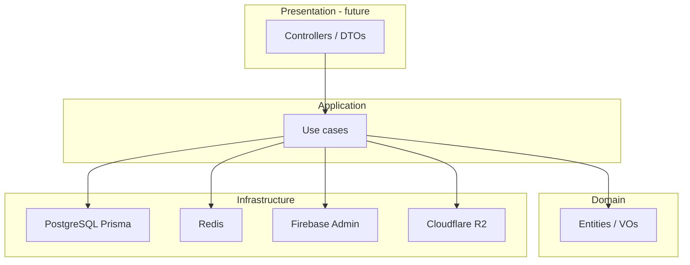

# AutoHub API — DDD Architecture

## Goals

- Modular monolith with clear domain boundaries
- Infrastructure adapters injectable and replaceable
- Business HTTP surface added only after domain design approval

## Layers



## Dependency rule

- Domains may depend on shared kernels and infrastructure ports
- Infrastructure must not depend on domain application services
- Presentation (controllers) must not contain business rules

## Composition root

`AppModule` wires:

1. `SharedModule` — cross-cutting HTTP concerns
2. `InfrastructureModule` — config, logger, DB, Redis, Firebase, R2, health
3. `DomainsModule` — all domain Nest modules
4. Global throttling guard

## Request pipeline

1. Helmet security headers
2. Compression
3. CORS
4. Request ID middleware
5. Throttler guard
6. Validation pipe
7. Domain/infra handlers
8. Response interceptor (success envelope) or exception filter (error envelope)

## Response envelope

Success:

```json
{
  "success": true,
  "data": {},
  "meta": { "requestId": "...", "timestamp": "..." }
}
```

Error:

```json
{
  "success": false,
  "error": { "statusCode": 400, "message": "..." },
  "meta": { "requestId": "...", "timestamp": "..." }
}
```

## OpenAPI

Swagger UI at `/docs`. Bearer auth scheme `firebase` is declared for future protected routes.
