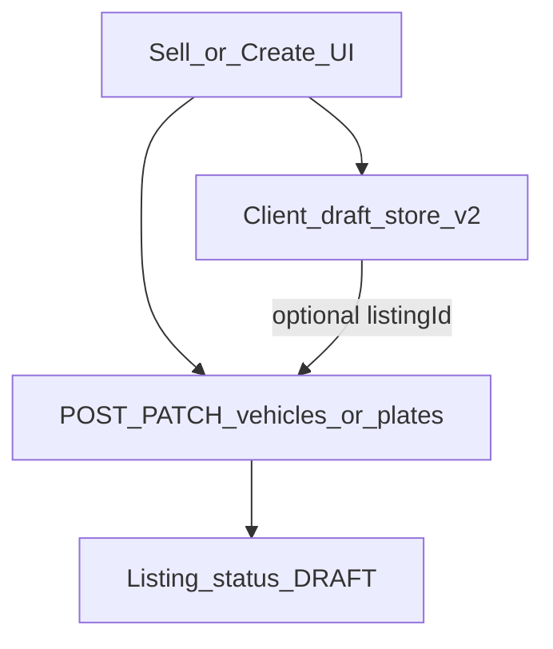

# Draft Engine Architecture (Release 0.5)

**Status:** Normative for Release **0.5**  
**Master release:** [`../releases/RELEASE_0.5_MARKETPLACE.md`](../releases/RELEASE_0.5_MARKETPLACE.md)

---

## Vision

Sellers never lose in-progress listing work across refresh or brief logout, using one coherent model: **client draft snapshot** plus optional **server `Listing.status = DRAFT`**—without inventing a Prisma `Draft` table.

---

## Goals

- Document and harden the existing web localStorage draft v2.
- Align web optional server DRAFT sync with mobile create’s sync pattern where practical.
- Deprecate dual mobile draft stores for new entry points (create path wins).
- Preserve legacy web draft v1 remap for upgrade safety.

---

## Scope

- P5-5 Draft Engine.
- Web: `apps/web/src/features/sell` draft-store.
- Mobile: `apps/mobile/src/features/create/data/draft-store.ts` (+ redirect away from legacy sell draft).
- Server: existing create/update as DRAFT only.

---

## Out of scope

- New `Draft` / `ListingDraft` Prisma model.
- Cross-device draft sync as a product (would need server draft listing id always—optional later).
- Offline-first CRDT sync.
- Auth freeze changes (token storage).

---

## User journeys

1. **Web local-only:** Seller fills steps → autosave to `localStorage` → refresh restores step + fields.
2. **Web + server (target harden):** After first authenticated save/create, `listingId` stored in client draft; further patches update server DRAFT.
3. **Mobile create:** AsyncStorage draft + `syncDraftRemote` to DRAFT listing (baseline).
4. **Submit:** Client draft cleared (or marked consumed) after successful PENDING transition.

---

## Domain architecture

| Store | Location | Role |
| --- | --- | --- |
| Web sell draft v2 | `features/sell` draft-store (`autohub.sell.draft`) | Primary web |
| Mobile create draft | `src/features/create/data/draft-store.ts` | Primary mobile |
| Mobile legacy sell draft | `features/sell/data/draft-store.ts` | Deprecate for new flows |

**Server truth for “saved draft listing”:** `Listing` row with `status = DRAFT`, not a separate table.

---

## Database impact

- None. Use `Listing.status = DRAFT`.

---

## API contracts

- `POST /v1/vehicles` / `POST /v1/plates` create DRAFT (default).
- `PATCH /v1/vehicles|:plates/:id` update content while DRAFT/allowed statuses.
- No `/v1/drafts` resource in 0.5.

---

## Web architecture

- Keep draft v2 schema; document fields + step id.
- On login return (`?next=/sell`), restore draft before wipe.
- When server `listingId` present, prefer PATCH over second POST.
- Clear draft on successful publish.

---

## Mobile compatibility

- Domain create remains the sync reference implementation.
- Legacy wizard entry should not write a second competing draft for the same user intent.
- Hub continues to surface local drafts for vehicle/plate.

---

## AI readiness

- Draft JSON is structured; future “resume assist” can read the same schema.
- No AI autofill in 0.5.

---

## Security considerations

- Client drafts may contain PII (phone in sale info)—do not log draft payloads.
- Server DRAFT listings must not appear in public Search (ACTIVE-only).
- Only owner can PATCH their DRAFT.

---

## Performance considerations

- Debounce local autosave; avoid PATCH storms (debounce server sync similarly).
- Do not load all historical DRAFTs into sell wizard—only active draft id.

---

## Testing strategy

- Unit: v1→v2 remap; serialize/deserialize.
- Manual: refresh mid-wizard; login round-trip with `next`.
- API: DRAFT not returned on public list/search.
- Mobile: create draft survives app reload.

---

## Production freeze criteria

- Single documented draft story for web + mobile create.
- Legacy mobile sell draft not required for new sells.
- No Prisma Draft migration shipped.
- Draft restore covered in QA checklist.
