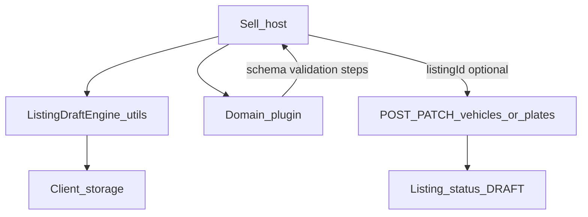

# Draft Engine Architecture (Release 0.5)

**Status:** Normative for Release **0.5** — **P5-5 implemented** (awaiting approval)  
**Master release:** [`../releases/RELEASE_0.5_MARKETPLACE.md`](../releases/RELEASE_0.5_MARKETPLACE.md)

---

## P5-5 audit summary

| Existing mechanism | Role | P5-5 decision |
| --- | --- | --- |
| Web `autohub.sell.draft` (v1/v2) | Primary web local draft | **Upgrade** to Listing Draft Engine envelope (`schemaVersion: 2` + `listingId` / `revision` / `meta`) |
| Mobile create `autohub.create.vehicles.v1` / `plates.v1` | Primary mobile multi-draft | **Keep** as domain payloads behind generic `createJsonDraftStore` |
| Mobile legacy `autohub.sell.drafts` | Competing vehicle wizard | **Deprecate** — `/sell/wizard` redirects to hub |
| Server `Listing.status = DRAFT` | Optional server snapshot | **Link** via `listingId` on save draft (PATCH on re-save) |
| Prisma Draft table | — | **Out of scope** (none) |

**Architecture rule:** The Draft Engine knows only generic listing drafts. Vehicles / plates / heavy equipment / future types own schema, validation, and step config inside plugins (`domainData` opaque).

---

## Vision

Sellers never lose in-progress listing work across refresh or brief logout, using one coherent model: **client draft envelope** plus optional **server `Listing.status = DRAFT`**—without inventing a Prisma `Draft` table.

---

## Goals

- One platform Listing Draft Engine (`@autohub/utils` listing-draft).
- Local persistence, autosave, resume last step, versioning, revision conflict helpers (future-ready).
- Web: keep local draft after “Save draft”; clear only after PENDING submit.
- Mobile: create path remains primary; legacy wizard does not write a second store.
- Preserve legacy web v1 remap + flat v2 upgrade.

---

## Scope

- P5-5 Draft Engine only.
- Shared engine in `packages/utils/src/listing-draft`.
- Web host adapter: `apps/web/src/features/sell/core/draft-store.ts` + `SellWizard`.
- Mobile: generic list store + legacy redirect.
- Server: existing create/update as DRAFT only (no `/v1/drafts`).

---

## Out of scope

- New `Draft` / `ListingDraft` Prisma model.
- Multi-device sync product (helpers only).
- Offline-first CRDT sync.
- Publish completeness gates (P5-6/P5-7).
- AI autofill.
- Auth freeze changes.

---

## Capability matrix

| Capability | Status |
| --- | --- |
| Local draft persistence | **Done** (web localStorage envelope; mobile AsyncStorage lists) |
| Future server-side drafts | **Ready** (`listingId` + `syncStatus`) |
| Automatic recovery | **Done** (hydrate on mount / hub resume) |
| Versioning | **Done** (`schemaVersion` + migrate v1 / flat v2) |
| Conflict detection | **Future-ready** (`revision`, `detectListingDraftRevisionConflict`) |
| Autosave | **Done** (debounced web; mobile create ~400ms) |
| Resume from last step | **Done** (`stepId`) |
| Multi-device | **Future** (revision compare helpers) |
| Offline | **Future** (local-first already; sync queue later) |
| AI-ready metadata | **Done** (`meta` bag; unused by engine) |
| Mobile compatibility | **Done** (create path + legacy redirect) |

---

## Domain architecture



| Layer | Owns |
| --- | --- |
| Draft Engine | Envelope, migrate, revision, pending media meta helpers, autosave helper |
| Sell host | Storage adapter, plugin resolve, step clamp, when to clear |
| Domain plugin | `domainData` schema, validators, steps, create/patch payload |

**Server truth for “saved draft listing”:** `Listing` row with `status = DRAFT`.

---

## Envelope (canonical)

```ts
{
  schemaVersion: 2,
  localId: string,
  listingId: string | null,
  domainId: string,
  workflowId: string,
  stepId: string,
  revision: number,
  createdAt: string,
  updatedAt: string,
  syncStatus: 'local' | 'server_draft' | 'consumed',
  meta: { syncedMediaAssetIds?: string[], ... },
  common: ListingDraftCommon,  // listing-generic fields
  domainData: unknown          // plugin-opaque
}
```

Storage key (web): `autohub.sell.draft` (unchanged for upgrade safety).

---

## Clear policy

| Action | Local draft | Server |
| --- | --- | --- |
| Autosave mid-wizard | Upsert envelope | None |
| Save draft | Keep + set `listingId` / `server_draft` | POST create or PATCH |
| Submit for review | **Clear** | Sync + PENDING |
| Discard (future) | Clear | Optional soft-delete DRAFT |

---

## Database impact

- None. Use `Listing.status = DRAFT`.

---

## API contracts

- `POST /v1/vehicles` / `POST /v1/plates` create DRAFT (default).
- `PATCH /v1/vehicles/:id` / `PATCH /v1/plates/:id` when `listingId` present.
- No `/v1/drafts` resource in 0.5.

---

## Security considerations

- Client drafts may contain PII — do not log draft payloads.
- Server DRAFT listings must not appear in public Search (ACTIVE-only).
- Only owner can PATCH their DRAFT.

---

## Testing strategy

- Unit: engine migrate / revision / pending media (`@autohub/utils`).
- Unit: web adapter hydrate / serialize / revision bump.
- Manual: refresh mid-wizard; save draft keeps local; submit clears; login `?next=/sell`.
- Mobile: `/sell/wizard` redirects to hub; create drafts still resume.

---

## Production freeze criteria

- Single documented draft story for web + mobile create.
- Legacy mobile sell draft not required for new sells.
- No Prisma Draft migration shipped.
- Draft restore covered in QA checklist.
