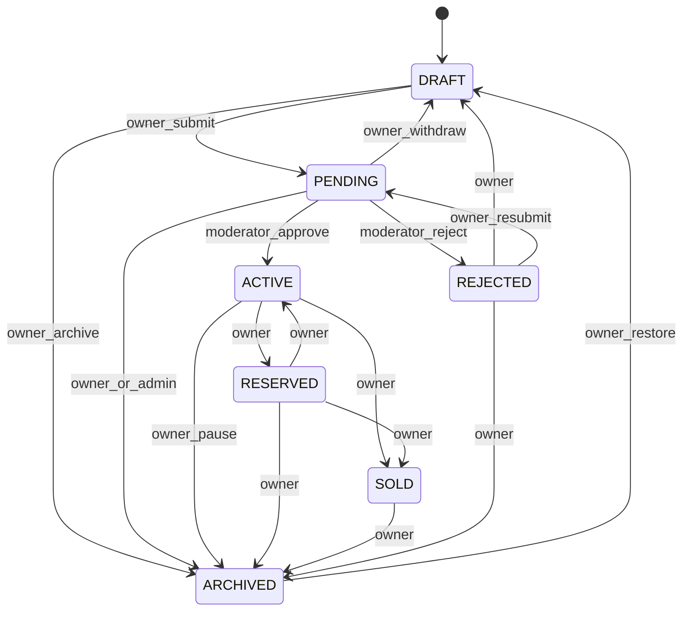

# Listing Lifecycle Architecture (Release 0.5)

**Status:** Normative for Release **0.5**  
**Source of truth (code):** `apps/api/src/domains/listings/domain/listing-status.ts`  
**Master release:** [`../releases/RELEASE_0.5_MARKETPLACE.md`](../releases/RELEASE_0.5_MARKETPLACE.md)

---

## Vision

A single, enforceable lifecycle for every marketplace listing so owners, moderators, and public clients never disagree about visibility or allowed actions.

---

## Goals

- Keep the existing transition map; document and test it as production policy.
- Ensure content updates never smuggle status (already hardened on domain PATCH).
- Align web Action Registry labels with real statuses (document Pause = ARCHIVED).
- Support sell submit → PENDING and moderator ACTIVE/REJECTED without new status enums in 0.5.

---

## Scope

- Document + test existing transitions for VEHICLE and PLATE.
- Wire My Listings / sell submit to existing `PATCH …/status` only.
- Clarify ownership vs moderation gates.

---

## Out of scope

- New statuses (e.g. EXPIRED) unless product explicitly adds later.
- Payments/escrow status overlays (0.7).
- Trust badges / verification product (0.8).
- Changing Search visibility rules (frozen Search already ACTIVE-scoped).

---

## User journeys

| Actor | Journey |
| --- | --- |
| Seller | DRAFT ↔ PENDING (submit/withdraw); ACTIVE → RESERVED / SOLD / ARCHIVED |
| Moderator | PENDING → ACTIVE or REJECTED |
| Seller after reject | REJECTED → DRAFT or PENDING (resubmit) |
| Seller pause | ACTIVE → ARCHIVED (UI “Pause”); ARCHIVED → DRAFT to rework |

---

## Domain architecture

**Code map:** `LISTING_STATUS_TRANSITIONS`, `canTransitionStatus`, `requiresModerationApproval` in `listing-status.ts`.  
**Application:** `ListingsService.changeStatus` / vehicles & plates status endpoints.  
**Web:** `features/listings/listing-actions.ts` Action Registry.

### Naming note

UI **Pause** maps to status **ARCHIVED** (BUG-022). 0.5 documents this; renaming the status enum is out of scope.

---

## Database impact

- Uses existing `ListingStatus` enum and `Listing.status`.
- No migration required for lifecycle in 0.5.

---

## API contracts

| Method | Path | Notes |
| --- | --- | --- |
| `PATCH` | `/v1/vehicles/:id/status` | Body `{ status }` |
| `PATCH` | `/v1/plates/:id/status` | Same |
| `PATCH` | `/v1/listings/:id/status` | Legacy/compat |
| Admin | `/v1/admin/vehicles|plates/…/approve\|reject` | Bridges to ACTIVE/REJECTED |

Content `PATCH` must not accept arbitrary status (lifecycle hardening already landed).

---

## Web architecture

- My Listings tabs filter by status; actions from Action Registry only.
- Sell submit: create (DRAFT) → attach media → transition PENDING when user publishes.
- Preview Mode does not change status.

---

## Mobile compatibility

- Domain create uses same status APIs.
- Manage screens must only offer transitions allowed by the map.

---

## AI readiness

- Status history is structured; future trust models may consume transitions—no AI in 0.5.

---

## Security considerations

- `PENDING → ACTIVE|REJECTED` requires `LISTINGS_MODERATE` (or admin).
- Owner/staff only for other transitions (`canManageListing`).
- Public APIs never return non-ACTIVE listings to anonymous/other users.

---

## Performance considerations

- Status change is a single-row update; no fan-out in 0.5 (messaging notifications are 0.6).

---

## Testing strategy

- Unit: every edge in `LISTING_STATUS_TRANSITIONS`.
- API: forbidden transition → 4xx; non-moderator cannot approve.
- Web: Action Registry offers only allowed actions per status.

---

## Production freeze criteria

- Transition matrix tests green.
- No status-via-content-PATCH regressions.
- Pause/ARCHIVED documented in release QA.
- No new status enum without a follow-up release.
