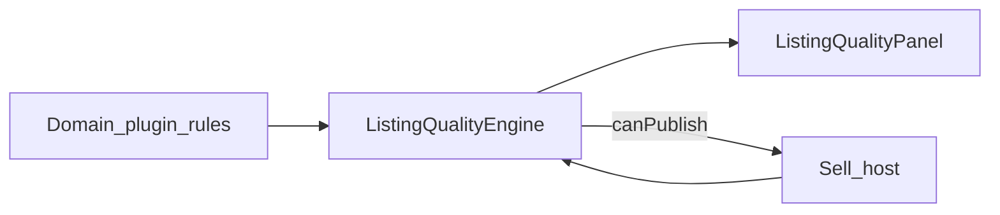

# Listing Quality & Completeness Architecture (Release 0.5)

**Status:** **FROZEN** with Release **0.5** (`marketplace-0.5-freeze`) — P5-6 implemented  

**Master release:** [`../releases/RELEASE_0.5_MARKETPLACE.md`](../releases/RELEASE_0.5_MARKETPLACE.md)

---

## P5-6 audit summary

| Finding | Decision |
| --- | --- |
| `validatePublishStep` was a no-op; `canSubmit` skipped location/media | **Replaced** with Listing Quality Engine `canPublish` |
| No score / checklist / tips UI | **Added** `ListingQualityPanel` on publish step |
| Step validators are boolean only | Kept for Next; quality engine owns publish completeness |
| Vehicle vs plate rules diverged (web/mobile) | Plugins contribute rules; engine is listing-generic |
| Quality ≠ only a progress bar | Score + grade + recommendations + required/recommended/premium |

**Product intent:** Help sellers create better listings. Required items gate PENDING; recommended/premium never block.

---

## Vision

Every listing submitted for review meets a clear completeness bar, and sellers see actionable quality guidance—without a new database product or AI ranker.

---

## Goals

- Listing-generic quality engine (`@autohub/utils` listing-quality).
- Plugins contribute scoring rules only.
- Engine owns: score, progress, recommendations, missing items, completion %.
- Separate **Required** / **Recommended** / **Premium**.
- Block PENDING submit only when required items are missing.
- Allow Save draft with incomplete required set.

---

## Scope

- P5-6 Listing Quality & Completeness Engine.
- Web publish checklist + score + tips.
- Vehicle + plate rule packs (future types add rules the same way).

---

## Out of scope

- Persisting `qualityScore` / Search ranking (Search frozen).
- AI-written titles/descriptions.
- Moderator ML risk scores (Trust 0.8).
- Full P5-7 publish UX polish beyond quality panel.
- Payments / messaging.

---

## Architecture



| Layer | Owns |
| --- | --- |
| Engine (`packages/utils/src/listing-quality`) | Evaluate rules → score, grade, progress, tips, `canPublish` |
| Common rules | Category, location, title, description, price, currency, photo/video bands |
| Plugin rule packs | Domain fields (year, VIN, plate identity, …) |
| Host | Wire `canSubmit`, Save vs Submit gating, panel UI |

### Result shape

```ts
{
  items, missingRequired, missingRecommended, missingPremium,
  canPublish,              // all required ok
  completionPercent,       // all items
  requiredCompletionPercent,
  score,                   // 0–100 weighted; capped ≤45 if !canPublish
  grade,                   // needs_work | ok | good | excellent
  recommendations[]        // prioritized actionable tips
}
```

### Severity policy

| Severity | Blocks PENDING? | Examples |
| --- | --- | --- |
| Required | **Yes** | Category, location, price, description, ≥1 photo (vehicles), year/specs |
| Recommended | No | Brand/model, color, more photos, richer description |
| Premium | No | VIN, video, large gallery |

---

## Database impact

- **None.** Score is derived client-side.

---

## API contracts

- No new quality endpoint in 0.5.
- Server hard validation unchanged; client required set must not be weaker for PENDING fields we already collect.

---

## Web architecture

- `plugin.getQualityRules(state)` → engine.
- `plugin.canSubmit` → `result.canPublish`.
- Publish step shows `ListingQualityPanel`.
- Submit for review disabled when `!canPublish`; Save draft always allowed (auth/busy aside).

---

## Mobile compatibility

- Create path may keep local validators short-term; shared engine is available via `@autohub/utils` for later parity.
- Score UI on mobile optional in 0.5.

---

## AI readiness

- Structured tips/ids are signals for future assistive copy — not implemented now.

---

## Testing strategy

- Unit: required missing → `canPublish=false`; premium missing does not block.
- Unit: photo/description bands move score upward.
- Unit: plate path does not require vehicle fields or photos.
- Manual: publish panel shows score + tips; draft save works incomplete.

---

## Production freeze criteria

- Noop publish validator removed (wired to engine).
- Vehicle/plate cannot PENDING without required set.
- Quality score + tips on web review.
- Score not used for Search ordering.
