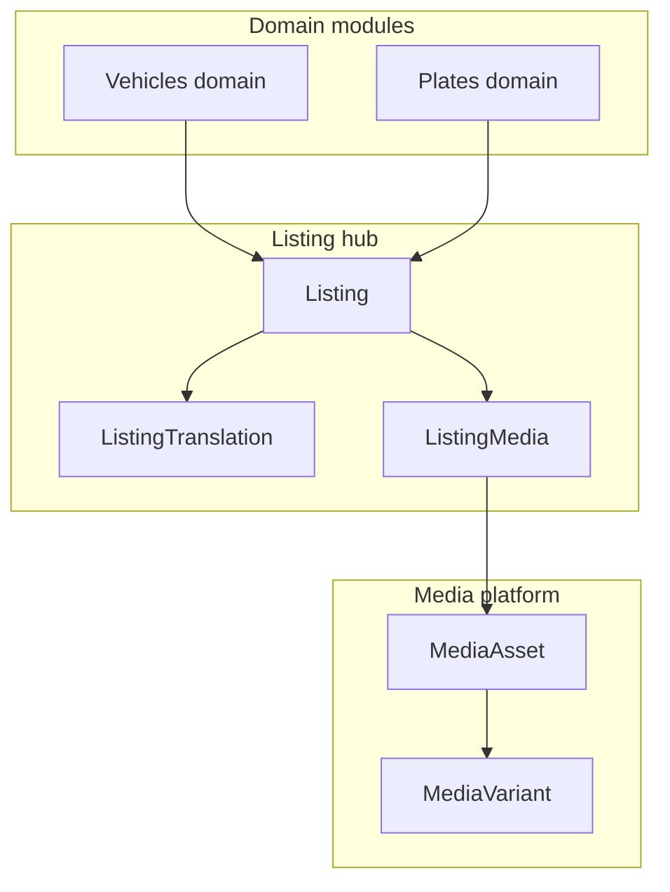

# Marketplace Architecture (Release 0.5)

**Status:** **FROZEN** with Release **0.5** (`marketplace-0.5-freeze`)  

**Baseline:** Closed-beta marketplace shipped under Release **0.4** (extend, do not rebuild)  
**Master release:** [`../releases/RELEASE_0.5_MARKETPLACE.md`](../releases/RELEASE_0.5_MARKETPLACE.md)  
**Frozen siblings:** Auth [`RELEASE_0.2`](../releases/RELEASE_0.2_AUTHENTICATION.md) · Search [`RELEASE_0.4_SEARCH_DISCOVERY`](../releases/RELEASE_0.4_SEARCH_DISCOVERY.md)

> Historical notes: [`../listings-architecture.md`](../listings-architecture.md) (Sprint 4). Prefer this document for 0.5 decisions.

---

## Vision

Ship the first **production-ready** AutoHub marketplace for vehicles and plates in Iraq: sellers create, complete, publish, and manage listings with trustworthy media and lifecycle; buyers discover ACTIVE inventory via the frozen Search path. Marketplace 0.5 hardens what 0.4 already shipped—it does not replace the listing hub or sell plugin host.

---

## Goals

- Production-grade sell → PENDING → moderate → ACTIVE path on web (primary) with mobile domain create compatibility.
- Trusted media attach (`mediaAssetId`), consistent primary/order, real completeness gates.
- Edit parity with create by reusing sell field sections (not a thin one-off form).
- Preserve domain separation: `VEHICLE` and `PLATE` APIs on shared `Listing` hub (ADR 001 / 002).
- Leave Auth and Search freezes untouched.

---

## Scope

| In scope | Notes |
| --- | --- |
| Web sell wizard hardening | Host + plugins already exist |
| Vehicle/plate create completeness | Validators, quality hints |
| Media pipeline trust | Seller attach unification |
| Draft engine coherence | Client + `Listing.status=DRAFT` |
| My Listings polish | Delete confirm, action fidelity |
| Edit listing refactor | Reuse sell fields |
| Admin moderation as-is | Approve/reject already shipped |
| Docs + freeze | P5-0 … P5-10 |

---

## Out of scope

- Auth / Search refactors (frozen)
- Messaging (Release **0.6**), Payments (**0.7**), Trust & Verification (**0.8**), Dealer Platform (**0.9**)
- Elasticsearch, geo radius, AI ranking/copy generation
- New verticals (Real Estate, Boats, …)
- Prisma `Draft` table
- Rebuild of sell plugin host or listing hub
- Treating mobile legacy `/sell/wizard` + `/v1/listings` as the future create path

---

## User journeys

1. **Seller create (web):** Login → `/sell` → category → details → media → sale info → review → submit PENDING → moderator ACTIVE.
2. **Seller create (mobile):** Hub → `/sell/vehicle` or `/sell/plate` (domain create) → same lifecycle.
3. **Seller manage:** My Listings → edit / pause (ARCHIVED) / activate / mark sold / delete (confirmed).
4. **Buyer browse:** Home / frozen `/vehicles/search` → ACTIVE detail → contact (messaging in 0.6).
5. **Moderator:** Admin queue → approve/reject PENDING.

---

## Domain architecture

| Layer | Path (baseline) |
| --- | --- |
| Web sell host | `apps/web/src/features/sell/` |
| Vehicle / plate plugins | `apps/web/src/features/vehicles/sell/`, `plates/sell/` |
| Shared listing chrome | `apps/web/src/features/listings/` |
| API vehicles / plates | `apps/api/src/domains/vehicles/`, `plates/` |
| Listings media + legacy | `apps/api/src/domains/listings/` |
| Media | `apps/api/src/domains/media/` |
| Mobile domain create | `apps/mobile/src/features/create/` |

---

## Database impact

- **No new Draft model** in 0.5.
- Prefer zero migrations; use existing `Listing`, detail tables, `ListingMedia.mediaAssetId`, `MediaAsset`.
- Migrations only if a required column is proven missing after payload audit (CAR-first).

---

## API contracts

| Surface | Endpoints (existing; tighten behavior) |
| --- | --- |
| Vehicles | `POST/PATCH/GET/DELETE /v1/vehicles`, `PATCH …/status` |
| Plates | Same pattern under `/v1/plates` + catalog |
| Media | `POST /v1/media/presign\|upload\|complete`, … |
| Listing media | `POST /v1/listings/:id/media`, reorder, primary, delete |
| Search | **Frozen** — do not change vehicle FTS/URL contracts |

Seller attach must prefer `mediaAssetId`; bare `r2Key` for non-staff is deprecated in 0.5 (see media-pipeline).

---

## Web architecture

- Keep domain-agnostic `SellWizard` + plugin registry.
- Edit route reuses sell field components + domain PATCH (P5-9).
- My Listings continues to use Action Registry (`listing-actions.ts`).
- Preview Mode on detail remains; sell review preview aligns to detail-critical fields (P5-7).

---

## Mobile compatibility

- Canonical: `app/sell/vehicle.tsx`, `app/sell/plate.tsx` + `src/features/create`.
- Legacy `app/sell/wizard.tsx` → redirect/deprecate (P5-5 / mobile slice notes).
- Full web-plugin host parity on Expo is **deferred** (not a 0.5 rebuild).

---

## AI readiness

- Structured completeness + quality score fields only (see listing-quality).
- No AI title/description generation or ranking in 0.5.

---

## Security considerations

- Do not reopen Auth freeze; use existing JWT + permissions.
- Ownership on content PATCH and media attach.
- Public reads ACTIVE-only (existing enforcement).
- Open-redirect-safe `?next=` for sell login return.

---

## Performance considerations

- Lean card/detail includes; avoid N+1 on my-listings and edit hydrate.
- Media variants already produced server-side; clients use URLs from API.
- Do not alter Search query path or indexes.

---

## Testing strategy

- Unit: validators, completeness, quality score helpers.
- API: attach trust, status transitions, create→PENDING.
- Web smoke: sell → PENDING → admin approve → ACTIVE visible in frozen search.
- Mobile smoke: domain create still works after attach tightening.

---

## Production freeze criteria

**FROZEN** (2026-08-04) — tag `marketplace-0.5-freeze`. See [`../releases/RELEASE_0.5_MARKETPLACE.md`](../releases/RELEASE_0.5_MARKETPLACE.md). Do not refactor marketplace sell/manage/edit/media-trust paths except production hotfixes. Deferred items live only in the release deferred list + tech debt companion.
