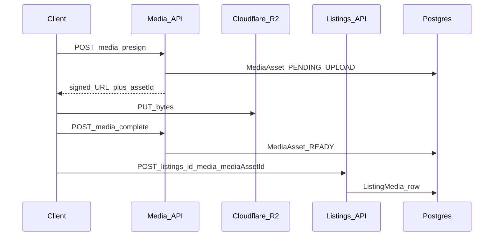

# Media Pipeline Architecture (Release 0.5)

**Status:** Normative for Release **0.5** (seller attach trust + gallery correctness)  
**Baseline:** Media platform Release **0.3** + Sprint 17 bridge  
**Historical:** [`../media-architecture.md`](../media-architecture.md)  
**Master release:** [`../releases/RELEASE_0.5_MARKETPLACE.md`](../releases/RELEASE_0.5_MARKETPLACE.md)  
**Related:** [`../releases/RELEASE_0.3_MEDIA.md`](../releases/RELEASE_0.3_MEDIA.md) (r2Key trust gap)

---

## Vision

Sellers upload media through a trusted pipeline: asset ownership is proven, gallery order is deterministic, and listings never attach attacker-controlled object keys.

---

## Goals

- Prefer `mediaAssetId` attach for all seller create/edit flows.
- Deprecate bare `r2Key` attach for non-staff clients.
- Primary image = `sortOrder === 0` (no separate isPrimary column).
- Keep MediaAsset platform independent of Listing (ownerModule / ownerEntityId).
- Do not touch Auth or Search freezes.

---

## Scope

- P5-4 Media Manager hardening.
- Web `MediaUploader` / sell submit attach order sync.
- API attach policy tightening on `POST /v1/listings/:id/media`.
- Document staff/legacy escape if required.

---

## Out of scope

- Replacing Cloudflare R2.
- Full virus-scan productization (hook may remain no-op with ops note).
- Dealer/user avatar MediaAsset product (deferred fields).
- Messaging attachments (0.6).

---

## User journeys

1. Seller selects images → presign → PUT R2 → complete → READY asset ids.
2. On listing create, attach ids in order; index 0 is primary.
3. Seller reorders / sets primary → reorder API or re-attach order; UI keeps IDs sorted with primary first.
4. Soft-delete media → 72h restore window (existing).

---

## Domain architecture

| Component | Path |
| --- | --- |
| Media domain | `apps/api/src/domains/media/` |
| Attach | `ListingsService` add-media + DTO |
| Web uploader | `apps/web/src/features/media/` |

---

## Database impact

- Existing: `MediaAsset`, `MediaVariant`, `ListingMedia.mediaAssetId`.
- Primary = lowest `sortOrder` (0).
- No schema change required for trust policy.

---

## API contracts

| Endpoint | 0.5 policy |
| --- | --- |
| `POST /v1/media/presign` | Unchanged |
| `POST /v1/media/complete` | Unchanged |
| `POST /v1/listings/:id/media` | **Seller:** require `mediaAssetId` owned/ready; reject bare `r2Key` |
| `PATCH …/media/reorder` | Keep |
| `POST …/media/:mediaId/primary` | Keep; must result in sortOrder 0 |

Staff may retain r2Key escape only if documented and permission-gated.

---

## Web architecture

- Sell and edit use `MediaUploader` with asset ids.
- On notify, ensure primary id is first in the ordered list passed to attach.
- Do not invent a second uploader for edit.

---

## Mobile compatibility

- Domain create must attach via `mediaAssetId` after trust tightening.
- Regression smoke after API reject of raw r2Key.

---

## AI readiness

- Image embeddings / auto-tagging out of scope.
- Structured media counts feed listing quality score.

---

## Security considerations

- Verify asset belongs to actor (or is attachable) before ListingMedia insert.
- No public write of arbitrary R2 keys into listings.
- Soft-delete retention unchanged (restore abuse monitored via admin media).

---

## Performance considerations

- Presign path avoids proxying large binaries when possible.
- Variants generated once on complete; listing cards use lean URLs.
- Cap gallery size (existing max ~30).

---

## Testing strategy

- API: seller cannot attach foreign `mediaAssetId` or raw `r2Key`.
- API: primary/reorder leaves sortOrder 0 as cover.
- Web: drag reorder + star primary updates ordered ids before submit.
- Integration: create listing with 3 images → public detail shows correct cover.

---

## Production freeze criteria

- Seller r2Key attach closed or staff-only with tests.
- Primary/order consistency verified.
- RC media-trust FAIL item closed or explicitly waived with compensating control in freeze notes.
