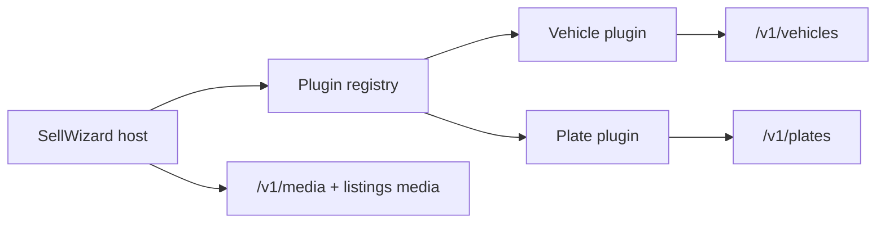

# Sell Wizard Architecture (Release 0.5)

**Status:** Normative for Release **0.5**  
**Baseline:** Domain-agnostic host + VEHICLE/PLATE plugins (Release 0.4)  
**Master release:** [`../releases/RELEASE_0.5_MARKETPLACE.md`](../releases/RELEASE_0.5_MARKETPLACE.md)  
**Code:** `apps/web/src/features/sell/`, `apps/web/src/features/vehicles/sell/`, `plates/sell/`

---

## Vision

One plugin-hosted sell experience that is safe to resume, hard to submit incomplete, and reusable for edit—without rebuilding the host.

---

## Goals

- Keep `SellWizard` + registry; extend via plugins only.
- Fix auth return path (`/login?next=/sell`) using existing `safe-next-path`.
- Real step/publish gates (completeness).
- Edit reuses sell field sections (P5-9), not a parallel thin form.
- Align review preview with visitor-critical detail fields.

---

## Scope

| Slice | Focus |
| --- | --- |
| P5-1 | Host foundation, `?next=` |
| P5-2 | Vehicle details field parity (CAR-first) |
| P5-3 | Price & location validation polish |
| P5-6 / P5-7 | Completeness + review/publish |
| P5-9 | Edit reuse |

---

## Out of scope

- New sell host framework or step engine rewrite.
- New marketplace domains in 0.5 (plugins later).
- Mobile Expo plugin host parity with web (deferred).
- Auth freeze changes.

---

## User journeys

1. Guest opens `/sell` → redirect `/login?next=/sell` → resume wizard.
2. Authenticated seller completes steps → review → PENDING.
3. Seller abandons mid-flow → local draft restore (see draft-engine).
4. Owner opens Edit → same field sections → PATCH (no full wizard forced).

---

## Domain architecture

### Typical vehicle step order (baseline)

`category` → `vehicleDetails` → `media` → `saleInformation` → `publish`

### Typical plate step order (baseline)

`category` → `plateDetails` → `saleInformation` → `publish` (media skipped today)

### Plugin contract (conceptual)

- Step list + labels
- Per-step validate / `canSubmit`
- Submit: create domain listing → attach media → optional PENDING

Do not invent a second plugin system.

---

## Database impact

None for host. Domain create uses existing Listing + detail rows.

---

## API contracts

- Create/update via `/v1/vehicles` and `/v1/plates` only for new work.
- Status via dedicated status endpoints.
- Media attach after create (see media-pipeline).

---

## Web architecture

| Concern | Approach |
| --- | --- |
| Login return | `router.replace('/login?next=/sell')` — BUG-004 |
| Drafts | Existing `draft-store` v2 (harden in P5-5) |
| Publish validator | Replace noop in `validators/publish.ts` |
| Edit | Extract shared field sections; edit page composes them |

---

## Mobile compatibility

- Mobile domain create remains canonical; not required to share React components with web.
- Payload parity for CAR specs is a 0.5 goal (P5-2).
- Legacy `/sell/wizard` redirected away from new entry points.

---

## AI readiness

- Completeness checklist is structured input for future assistive UX.
- No AI-generated listing copy in 0.5.

---

## Security considerations

- Reuse `safe-next-path` for `next` (no open redirects).
- Authenticated create/update only.
- Never set ACTIVE from client submit (PENDING only).

---

## Performance considerations

- Catalog data cached (existing marketplace catalog hooks).
- Avoid re-fetching full listing on every step; hydrate edit once.

---

## Testing strategy

- Unit: step validators, publish completeness, safe-next.
- E2E/smoke: unauth → login → return; full vehicle submit; plate submit.
- Edit: PATCH round-trip without status change.

---

## Production freeze criteria

- BUG-004 closed.
- Noop publish validator gone.
- Edit no longer “title/price only” for vehicle core fields.
- Host not rewritten; plugins still register the same way.

---

## Wizard UX audit (post P5-1 — deferred improvements)

Reviewed end-to-end from the seller’s perspective. **Do not redesign the host.** Capture only gaps for later slices.

| Area | Current | Remaining improvement | Slice |
| --- | --- | --- | --- |
| Step navigation | Back/Next + per-step validators; Next click guarded | Shared completeness should also gate Publish (not only Next) | P5-6 |
| Browser refresh | localStorage draft v2 restores step + fields | Optional server DRAFT sync after first save | P5-5 |
| Browser Back/Forward | In-wizard Back is app button only; browser history does not map to steps | Optional `?step=` URL sync (must not break drafts) | Deferred / post-0.5 unless needed |
| Mobile usability | Responsive grid on details; full-width actions | Touch targets / sticky actions polish if QA fails | P5-8 polish |
| Draft persistence | Debounced local autosave | Unify dual mobile stores; recover after login (done for path) | P5-5 |
| Validation consistency | Step validators vary; publish validator still weak | Shared checklist vehicle/plate; kill noop publish | P5-6 |
| Progress indicator | Bar + “Step N of M” | Announce step changes to AT (`aria-live`) | P5-7 / a11y polish |
| Accessibility | Native inputs/labels | Focus manage on step change; progress `aria-valuenow` | P5-7 |
| Keyboard navigation | Tab through fields; buttons focusable | Ensure Enter does not skip validation | P5-6 |
| Error recovery | Publish error string; no per-field errors | Inline field errors + submit retry messaging | P5-6 / P5-7 |
| Media compatibility | Media step + asset ids exist | Primary/sortOrder + r2Key trust | P5-4 |
| Draft engine compatibility | Client-only draft | Align with mobile create sync; no Draft table | P5-5 |
| Completeness compatibility | `canSubmit` incomplete | Real publish gates + quality tips | P5-6 / P5-7 |
| Vehicle field parity | Title/year/mileage/brand/model only | Catalog fuel/trans/body (+ API `makeId`) | **P5-2** |
