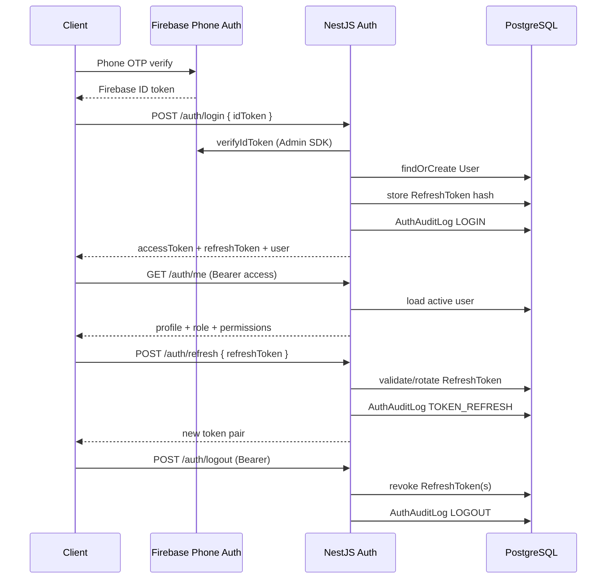

# Auth Architecture

## Components



## Token model

| Token | Format | Storage | Lifetime |
| --- | --- | --- | --- |
| Access | JWT (HS256) | Client only | `JWT_ACCESS_TTL_SECONDS` (default 15m) |
| Refresh | Opaque random | SHA-256 hash in `RefreshToken` | `JWT_REFRESH_TTL_SECONDS` (default 30d) |

Access JWT claims: `sub`, `role`, `permissions`, `firebaseUid`, `phone`.

Refresh rotation: each refresh revokes the previous token; reuse of a revoked token revokes the whole token family.

## DDD placement

```
domains/auth/
  domain/           permissions, types
  application/      AuthService
  infrastructure/   RefreshToken + AuthAudit repositories
  presentation/     AuthController, guards, DTOs

domains/users/
  application/      UsersService (profile init)
  infrastructure/   UserRepository
```

## Authorization model

- Role hierarchy for coarse checks (`@Roles`)
- Permission checks for fine-grained route protection (`@Permissions`)
- `SUPER_ADMIN` bypasses role checks; still carries full permission set

## Out of scope (later sprints)

- Social providers beyond phone
- Admin role assignment APIs
- Listing/moderation business endpoints
