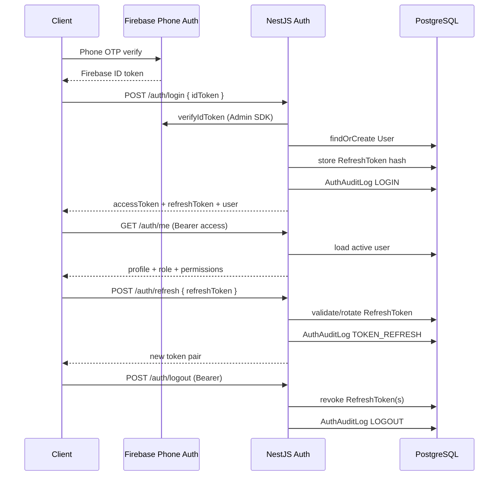

# Auth Architecture

## Components



## Token model

| Token | Format | Storage | Lifetime |
| --- | --- | --- | --- |
| Access | JWT (HS256) | Client only | `JWT_ACCESS_TTL_SECONDS` (default 15m) |
| Refresh | Opaque random | SHA-256 hash in `RefreshToken` | `JWT_REFRESH_TTL_SECONDS` (default 30d) |

Access JWT claims: `sub`, `role`, `permissions`, `firebaseUid`, `phone`.

Refresh rotation: each refresh revokes the previous token; reuse of a revoked token revokes the whole token family.

## DDD placement

```
domains/auth/
  domain/           permissions, types
  application/      AuthService
  infrastructure/   RefreshToken + AuthAudit repositories
  presentation/     AuthController, guards, DTOs

domains/users/
  application/      UsersService (profile init)
  infrastructure/   UserRepository
```

## Authorization model

- Role hierarchy for coarse checks (`@Roles`)
- Permission checks for fine-grained route protection (`@Permissions`)
- `SUPER_ADMIN` bypasses role checks; still carries full permission set

## Production hardening (Release 0.2 Phase A)

When `NODE_ENV=production`, API boot validation requires:

- Strong `JWT_ACCESS_SECRET` (min 32 characters, not the development placeholder)
- Firebase Admin credentials (`FIREBASE_PROJECT_ID`, `FIREBASE_CLIENT_EMAIL`, `FIREBASE_PRIVATE_KEY`)

Public auth routes are rate-limited more tightly than the global default (`login` / `staff-login` / `dev-login`: 20/min; `refresh`: 60/min).

## Non-Firebase login (development / staging only)

| Endpoint | Env flag | Purpose |
| --- | --- | --- |
| `POST /v1/auth/dev-login` | `AUTH_ALLOW_DEV_LOGIN` | Consumer RC without Firebase |
| `POST /v1/auth/staff-login` | `AUTH_ALLOW_STAFF_LOGIN` | Admin seed/staff phone login |

When `NODE_ENV=production`, both are **always disabled** (env cannot override).

Legacy `ALLOW_STAFF_DEV_LOGIN` is dual-read in Release 0.2 (deprecation warning) and removed in Release 0.3.

## Client auth modes (Release 0.2)

| App | Modes | Production build |
| --- | --- | --- |
| Web | `firebase` \| `dev` (aliases: `api`→firebase, `mock`→dev) | Must be `firebase` |
| Mobile | `firebase` \| `dev` (same aliases) | Must be `firebase` |
| Admin | `staff` \| `firebase` | Must **not** be `staff` |

`dev` / `staff` require a reachable API. Offline synthetic tokens are not supported.

Web/admin store bearer tokens in `localStorage` (temporary — see ADR 005). Mobile uses SecureStore.

## Out of scope (later sprints)

- Social providers beyond phone
- Admin role assignment APIs
- Listing/moderation business endpoints
- httpOnly cookie / BFF session (future ADR)
