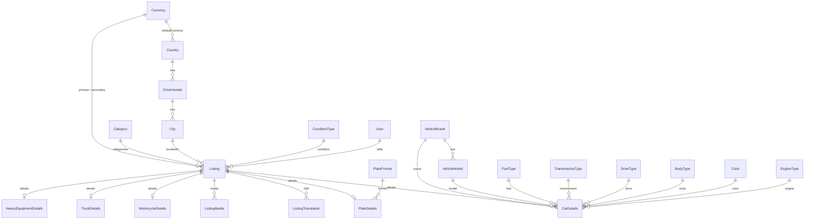

# AutoHub Database — Listing Hub (Revised Foundation)

Migration: `20260723160000_listing_hub_revisions`  
Seed: 2 currencies · 5 categories · 18 governorates · 8 brands · fuel/body/transmission/drive/color/engine/condition refs

**No API endpoints yet** — schema + seed only until approved.

## Design principles

1. **Listing is the hub** — every marketplace item is one `Listing` row.
2. **Category details** use class-table inheritance (`CarDetails`, `PlateDetails`, …).
3. **Currency is a table** — listings reference currencies by FK (`primaryCurrencyId` / `secondaryCurrencyId`) for dual-price display and multi-country expansion.
4. **Vehicle specs are normalized** — fuel, transmission, drive, body, color, engine, and condition are reference tables.
5. **Audit + soft delete** — important tables carry `createdAt`, `updatedAt`, `createdById`, `updatedById`, `deletedAt`.
6. **Future modules** (`Auction`, `Order`, `DealerOrganization`, …) exist in schema only.

## Entity relationship (core)

## Spec reference tables

| Table | Purpose | Example codes |
| --- | --- | --- |
| `FuelType` | Fuel | PETROL, DIESEL, HYBRID, ELECTRIC, LPG |
| `TransmissionType` | Gearbox | AUTOMATIC, MANUAL, CVT |
| `DriveType` | Drivetrain | FWD, RWD, AWD, FOUR_WD |
| `BodyType` | Body style | SEDAN, SUV, HATCHBACK, … |
| `Color` | Exterior color (+ optional `hex`) | WHITE, BLACK, … |
| `EngineType` | Engine layout / type | INLINE4, V6, ELECTRIC_MOTOR |
| `ConditionType` | Listing condition | NEW, USED, CERTIFIED |

Detail tables (`CarDetails`, etc.) store FKs to these refs, not free-text enums.

## Listing fields (SEO, stats, verification)

| Group | Fields |
| --- | --- |
| Price | `primaryPrice`, `primaryCurrencyId`, `secondaryPrice`, `secondaryCurrencyId`, `fxRateSnapshot` |
| SEO | `slug` (unique), `metaTitle`, `metaDescription` |
| Stats | `viewsCount`, `favoritesCount`, `sharesCount`, `phoneClicks`, `whatsappClicks` |
| Verification | `isFeatured`, `isVerified`, `verificationStatus`, `featuredUntil` |
| Audit | `createdAt`, `updatedAt`, `createdById`, `updatedById`, `deletedAt` |

## Media

`ListingMedia.mediaType` uses enum `MediaType`:

- `IMAGE`
- `VIDEO`
- `MEDIA_360`
- `DOCUMENT`

## Search indexes (Listing + brand/model)

On `Listing`:

- `(status, categoryCode, cityId)`
- `(categoryId, status)`, `(cityId, status)`
- `primaryPrice`, `secondaryPrice`
- `status`, `(isFeatured, status)`
- `createdAt`, `publishedAt DESC`
- `slug`, `deletedAt`

On detail / catalog:

- `CarDetails` / `MotorcycleDetails` / `TruckDetails`: `brandId`, `modelId`
- `VehicleBrand`: `(category, active)`, `slug`
- `VehicleModel`: `brandId`, `slug`

## Seed summary

| Entity | Count (approx.) |
| --- | --- |
| Currency | IQD, USD |
| Category | cars, plates, motorcycles, trucks, heavy-equipment |
| Country | Iraq (`IQ`) with default currency IQD |
| Governorate / City | 18 governorates + capital/launch cities |
| Spec refs | fuel, transmission, drive, body, color, engine, condition |
| VehicleBrand / Model | common car brands + motorcycle/truck starters |

## Related docs

- Prisma package notes: [`packages/database/README.md`](../packages/database/README.md)
- ADR currency: [`docs/adr/003-dual-currency-i18n.md`](./adr/003-dual-currency-i18n.md)
- Listing hub ADR: [`docs/adr/002-listing-hub.md`](./adr/002-listing-hub.md)
