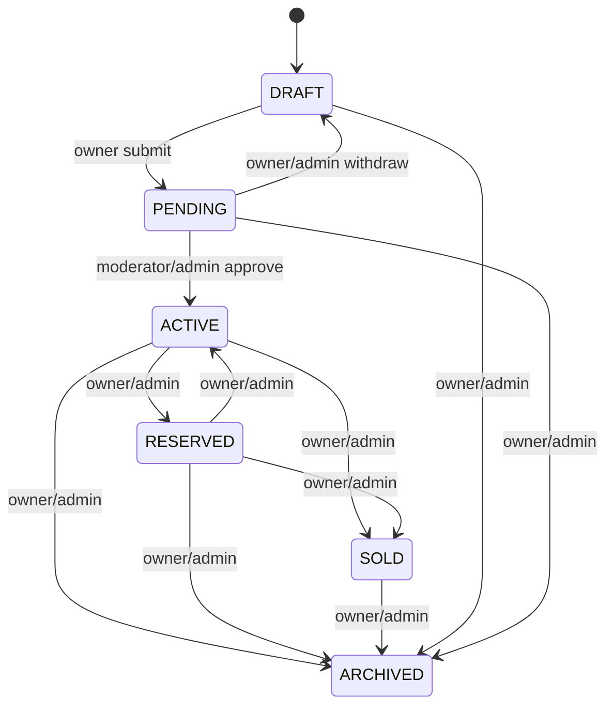

# Listings Architecture (Sprint 4)

## Layering

```
presentation/   ListingsController + DTOs
application/    ListingsService + ListingValidationService
domain/         status transitions, media type mapping, ownership policies
infrastructure/ Prisma repositories + ThumbnailService
```

## Lifecycle



## Ownership

`canManageListing`:

- sellerId === actor.id, or
- actor role is ADMIN / SUPER_ADMIN

Approval (`PENDING → ACTIVE`) additionally requires `LISTINGS_MODERATE`.

## Validation

| Concern | Rule |
| --- | --- |
| Category | Must exist and be active |
| Location | City active; belongs to country |
| Price | `>= 0` when provided |
| Currency | Active currency FK when provided |
| Brand/Model | Valid pair when provided |
| Media | IMAGE/VIDEO/360_MEDIA; max 30 items |

## Search

Repository builds Prisma `where` with joins to `City.governorate`, vehicle detail tables (brand/model), and `ListingTranslation` for keyword.

Public default status filter: `ACTIVE`.

## Thumbnails

`ThumbnailService`:

1. Derives `thumbnailKey` from `r2Key` (`*.thumb.jpg`)
2. For IMAGE + optional buffer: sharp → 480px JPEG metadata
3. VIDEO / 360: key convention only (poster filled by client/worker later)
