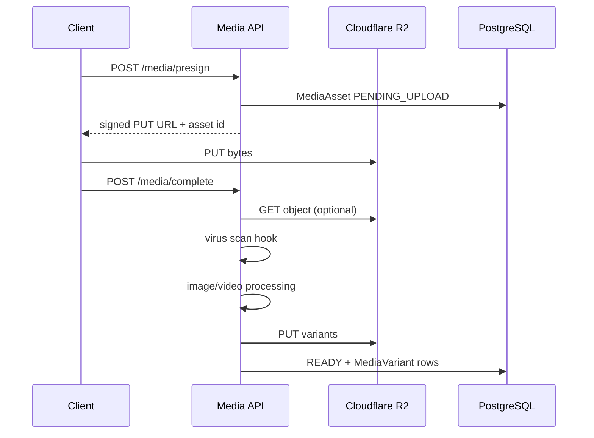

# Media Platform Architecture (Sprint 6)

## Independence

`MediaAsset` / `MediaVariant` live outside the Listing aggregate. Any domain can own media via:

- `ownerModule` (string, e.g. `listings`, `dealers`, `users`)
- `ownerEntityId` (string FK-like reference in the owning module)

Listings’ existing `ListingMedia` remains for listing-specific gallery rows; the platform service is the reusable upload/processing layer.

## Flow

Alternate: `POST /media/upload` streams multipart through the API (direct upload).

## Storage

`R2StorageService`:

- `putObject` / `deleteObject` / `getObjectBuffer`
- `createPresignedUploadUrl` / `createPresignedDownloadUrl`
- `getPublicUrl` for `PUBLIC` assets

## Security

| Control | Implementation |
| --- | --- |
| AuthZ | JWT + `MEDIA_UPLOAD` / `MEDIA_READ` / `MEDIA_DELETE` |
| Ownership | Owner or ADMIN/SUPER_ADMIN |
| MIME allow-list | Per media type |
| Max size | Per media type |
| Rate limit | `@Throttle` on mutating routes |
| Virus scan | `VIRUS_SCANNER` DI token (default no-op) |

## Image pipeline

sharp: rotate (EXIF orientation) → resize variants → JPEG mozjpeg + WebP → metadata stripped by default.

## Video pipeline

- Validate MIME/size
- Duration via MP4 `mvhd` parse or client `durationSeconds`
- `extractPoster` hook ready for ffmpeg later
