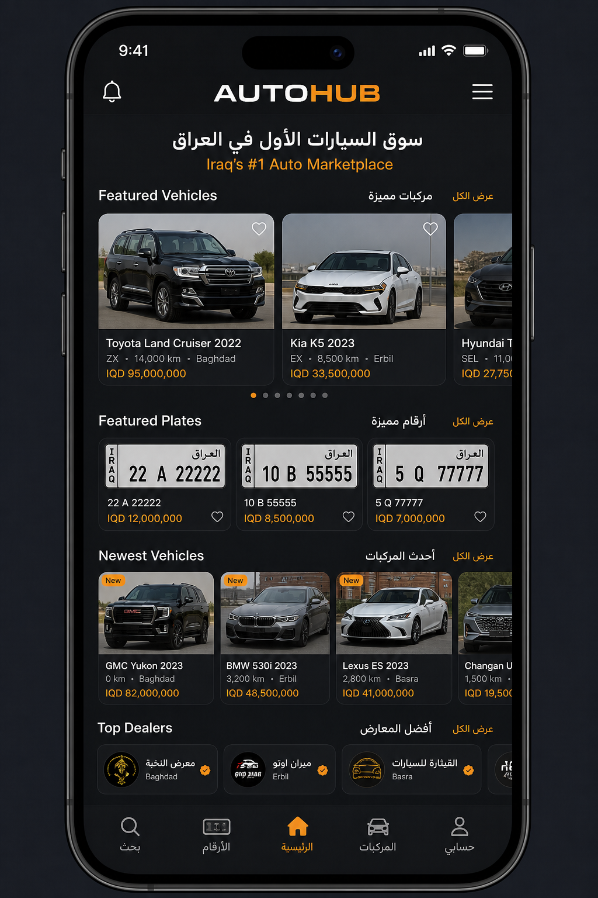
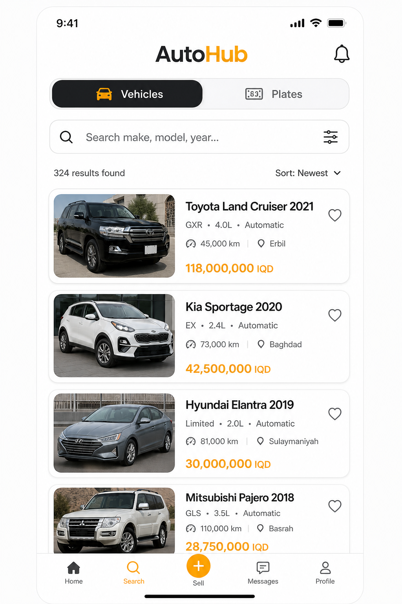
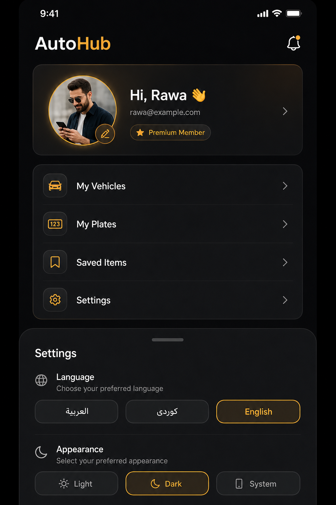

# Sprint 21 — AutoHub Mobile Platform

Production foundation for the AutoHub mobile app (Expo SDK 52 + React Native) consuming existing Nest APIs without backend architecture changes.

## Architecture

```
apps/mobile/
  app/                         # Expo Router screens (presentation)
    (auth)/                    # onboarding, welcome, login, OTP, profile-setup
    (tabs)/                    # home, search, explore, notifications, account
    vehicle/[id].tsx           # Vehicle domain detail
    plate/[id].tsx             # Plate domain detail
    settings.tsx / saved.tsx
    my-vehicles/ my-plates/
  src/                         # Enterprise application layer (Sprint 21)
    features/
      vehicles/                # /v1/vehicles*
      plates/                  # /v1/plates*
      dealers/                 # /v1/dealers*
      favorites/               # Zustand persisted favorites
      preferences/             # locale + scheme + onboarding
    components/                # MenuRow, MarketplaceRail, MarketDetailScreen…
    providers/                 # PreferencesBridge (RTL + theme sync)
    services/                  # expo-notifications foundation
    hooks/                     # marketplace path helpers
    theme/ types/ lib/
  features/                    # Existing modules (auth, home, sell, listing-detail…)
  lib/                         # HTTP client, secure tokens, query client
```

**Shared design system:** `@autohub/mobile-ui` (theme, i18n AR/KU/EN, RTL, dark/light).

**State:** React Query (server), Zustand (favorites + preferences), AuthProvider (session).

## Folder structure (Sprint 21 surface)

| Path | Role |
| --- | --- |
| `app/` | Routes / screens |
| `src/features/*` | Domain repositories + hooks |
| `src/components/*` | Shared UI composition |
| `src/providers/*` | App bridges |
| `src/services/*` | Device services (notifications) |
| `src/hooks/*` | Cross-cutting hooks |
| `src/theme/*` | Theme re-exports |
| `src/types/*` | Shared TS models |
| `features/auth/*` | Splash session restore, login, OTP, refresh, logout |

## Screenshots







## Implemented APIs

| Area | Endpoints |
| --- | --- |
| Auth (existing) | `POST /v1/auth/login`, `/refresh`, `/logout`, `GET /v1/auth/me` |
| Vehicles | `GET /v1/vehicles`, `/v1/vehicles/search`, `/v1/vehicles/:id` (+ `mine=true`) |
| Plates | `GET /v1/plates`, `/v1/plates/search`, `/v1/plates/:id` (+ `mine=true`) |
| Dealers | `GET /v1/dealers` |
| Categories / recent | `GET /v1/search/trending`, `/v1/search/recent` |
| Media bridge | Full listing still via `/v1/listings/:id` when opened from detail |

## Features delivered

### Authentication
- Splash + session restore (Secure Store)
- Onboarding (first launch)
- Login → OTP → profile setup
- Token refresh (HTTP 401 single-flight)
- Auto-login / logout

### Home
- Featured Vehicles / Featured Plates
- Newest Vehicles / Newest Plates
- Dealers rail
- Categories + dual marketplace quick actions
- Search entry

### Search
- Independent **Vehicles** and **Plates** tabs
- Vehicle keyword search → `/v1/vehicles/search`
- Plate keyword + prefix + number → `/v1/plates/search`

### Details
- `/vehicle/:id` and `/plate/:id` domain screens
- Gallery/image, specs / plate display, contact stub, favorite, share
- Full listing view still available for seller contact/report

### Profile
- My Vehicles / My Plates / Saved Items / Settings
- Settings: AR / KU / EN + Light / Dark / System
- Notification permission foundation (`expo-notifications`)

### Design
- Dark / light (system + manual)
- Arabic + Kurdish RTL + English
- Reanimated onboarding entrance
- Expo Image on domain detail

## Quality

| Check | Result |
| --- | --- |
| `pnpm lint` | ✅ (0 warnings; react-hooks@5 override for ESLint 9) |
| `pnpm typecheck` | ✅ |
| `pnpm build` | ✅ (`tsc --noEmit` compile gate) |

`export:native` (`expo export`) remains available for Metro bundles; full store binaries use EAS (`eas.json`).

## Dependencies added

- `zustand`
- `expo-notifications` (~0.29 for SDK 52)
- `@expo/metro-runtime`, `@babel/runtime`, `whatwg-fetch` (export support)
- `eslint-plugin-react-hooks@5`

## Remaining roadmap

1. **Seller contact** on domain detail from API `sellerContact` (wire Call / WhatsApp like listing ActionBar)
2. **Plate SVG renderer** on mobile (web already has `LicensePlate`)
3. **Push device registry** API + notification inbox (tab is still a placeholder)
4. **Vehicle catalog filters** on search (make/model/year/mileage UI)
5. **Offline cache** hydration for home rails
6. **EAS production builds** + store listing assets
7. Gradual migration of legacy `features/*` into `src/features/*`
8. Optional move of Expo Router to `src/app` once tooling is ready

## Run locally

```bash
pnpm --filter @autohub/mobile dev
# EXPO_PUBLIC_API_URL=http://<lan-ip>:4000
# EXPO_PUBLIC_AUTH_MODE=mock   # OTP 123456
```
