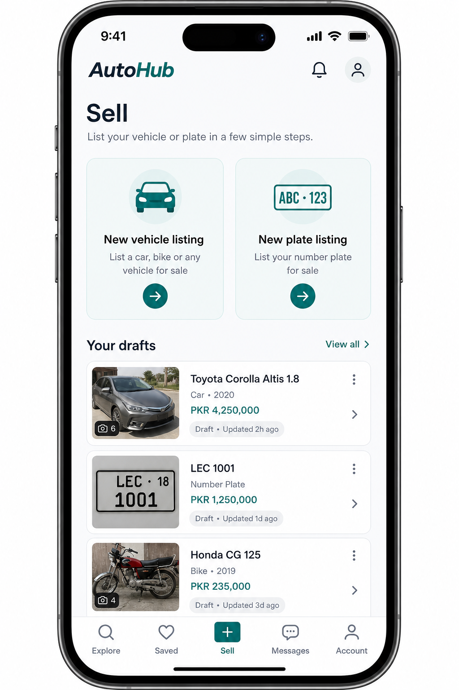
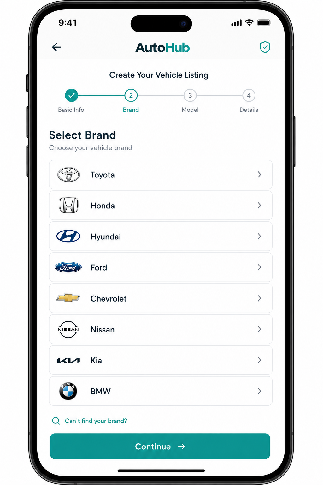
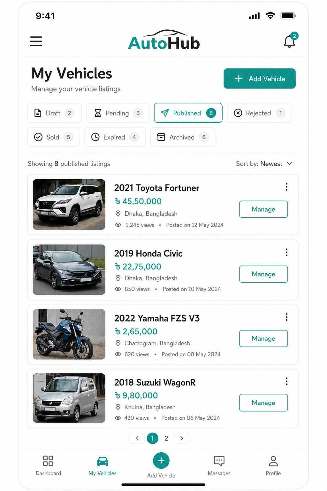
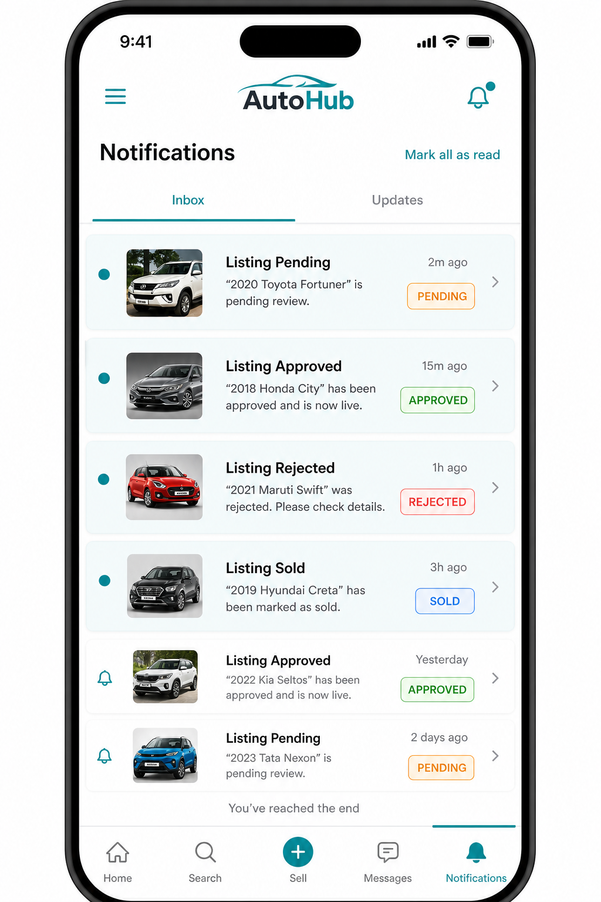

# Sprint 22 — Mobile Listing Creation Platform

Transforms AutoHub mobile from browse-only into a full marketplace for creating, editing, publishing, and managing **Vehicle** and **Plate** listings — using existing Nest APIs only (no backend architecture changes).

## Folder structure

```
apps/mobile/
  app/
    sell/
      index.tsx              # Sell hub: Vehicle vs Plate + resume drafts
      vehicle.tsx            # 9-step Vehicle wizard
      plate.tsx              # Plate wizard
      wizard.tsx             # Legacy listings wizard (kept)
    my-vehicles/index.tsx    # Manage Vehicles (status tabs + actions)
    my-plates/index.tsx      # Manage Plates
    (tabs)/notifications.tsx # Listing status inbox
  src/features/
    catalog/                 # GET /v1/catalog/filters + plate catalog
    create/
      components/            # WizardChrome, OptionPicker, MediaStep
      data/                  # draft store, media upload/compress, create repos
      domain/                # vehicle/plate drafts, validation, media types
      di.ts
    manage/                  # Domain manage list + actions (vehicles/plates)
    favorites/               # Offline cache + reconnect flush (FavoritesSync)
    notifications/           # Listing status store + StatusChangeWatcher
```

## Implemented APIs

| Area | Endpoints |
| --- | --- |
| Catalog | `GET /v1/catalog/filters` |
| Plate catalog | `GET /v1/plates/catalog/provinces`, `/categories`, `/prefixes` |
| Vehicles create/edit | `POST/PATCH /v1/vehicles`, `PATCH /v1/vehicles/:id/status`, `DELETE /v1/vehicles/:id` |
| Plates create/edit | `POST/PATCH /v1/plates`, `PATCH /v1/plates/:id/status`, `DELETE /v1/plates/:id` |
| Own listings | `GET /v1/vehicles?mine=true&status=…`, `GET /v1/plates?mine=true&status=…` |
| Media (R2) | `POST /v1/media/upload` + `POST /v1/listings/:id/media` (+ reorder/delete) |

**Edit after publish:** PATCH sends only changed fields (vehicle + plate create repos).

**Duplicate:** no public duplicate API — client creates a new draft from source fields (plates load detail for format/series/number).

**Status mapping**

| UI tab | API status |
| --- | --- |
| Draft | `DRAFT` |
| Pending | `PENDING` |
| Published | `ACTIVE` |
| Rejected | `REJECTED` |
| Sold | `SOLD` |
| Expired | Client filter on `expiresAt` (no `EXPIRED` enum) |
| Archived / Pause | `ARCHIVED` |
| Activate | `ACTIVE` (from `RESERVED`) or `PENDING` republish |

## Features delivered

### Vehicle wizard (9 steps)
Category → Brand → Model → Year → Specs (fuel, transmission, body, mileage, engine, colour, drive, condition, VIN) → Price/currency/negotiable → Description (+ city) → Photos → Preview/Publish.

### Plate wizard
Province → Category → Prefix → Number/Digits → Price/negotiable → Description → Photos → Preview/Publish.

### Media
Camera + gallery, crop/resize (`expo-image-manipulator`), compress, reorder, delete, multi-select, upload progress, retry failed, attach via listings media bridge, Expo Image disk cache on manage cards.

### My Vehicles / My Plates
Status tabs + actions: Edit, Delete, Republish, Pause, Activate, Share, Duplicate, Mark sold.

### Favourites
Zustand + AsyncStorage offline cache; `pendingOps` queue; `FavoritesSync` flushes on reconnect (local — no favorites API yet).

### Notifications
In-app inbox for Pending / Approved (`ACTIVE`) / Rejected / Sold / Expired; `StatusChangeWatcher` polls own listings every 60s.

### UX
Autosave drafts (AsyncStorage), offline banner, skeleton loading on manage lists, progress bar on wizards.

## Screenshots









> Note: screenshots are UI mock references for the Sprint 22 surfaces. Run `pnpm --filter @autohub/mobile dev` for live device/simulator captures.

## Performance notes

- Catalog filters cached 5 minutes (React Query `staleTime`).
- Draft autosave debounced (~400ms) to AsyncStorage — survives app kill.
- Images resized to max width 1600 + JPEG ~0.82 before upload; upload retries with exponential backoff (3 attempts).
- Manage lists paginated (`pageSize` 20); status watcher capped at 50 items/domain.
- Favorites capped at 200 items; notification inbox capped at 100.

## QA results

| Check | Result |
| --- | --- |
| `pnpm lint` (`@autohub/mobile`) | Pass (`--max-warnings=0`) |
| `pnpm typecheck` | Pass |
| `pnpm build` (`tsc --noEmit`) | Pass |

## Out of scope / known limits

- No backend favorites or device-push registry — favorites sync and status alerts are local/offline-first.
- `EXPIRED` is derived from `expiresAt`, not a Prisma status.
- Legacy `/sell/wizard` (unified listings) remains available; Sell hub defaults to domain wizards.
- Currency IDs sent as `IQD`/`USD` codes (same pattern as web); seed may use opaque IDs in some environments.

## How to verify manually

1. Open Sell → **New vehicle listing** → walk 9 steps → Publish → see Pending notification → My Vehicles.
2. Open Sell → **New plate listing** → complete wizard → My Plates.
3. Manage → Pause / Republish / Share / Duplicate / Edit (changed-field PATCH).
4. Toggle favorites offline → reconnect → queue flushes (`lastSyncedAt` updates).
