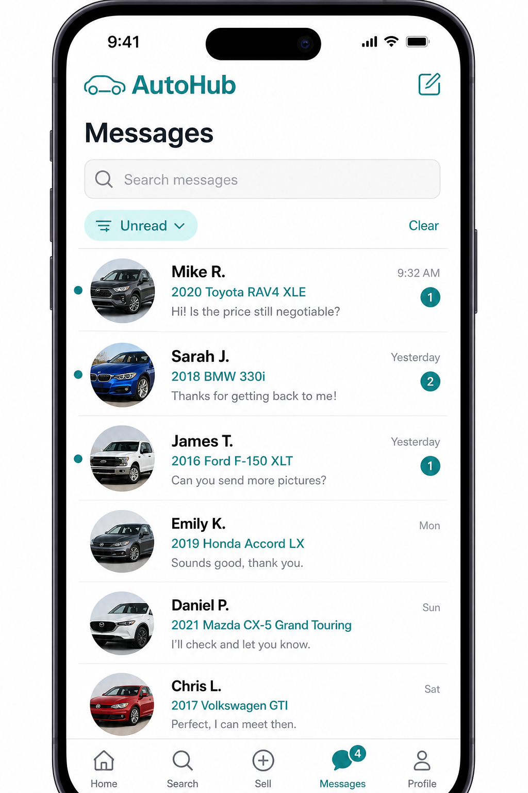
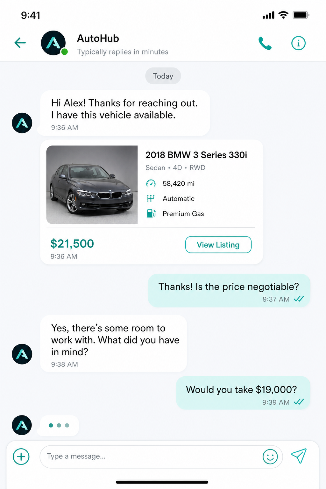
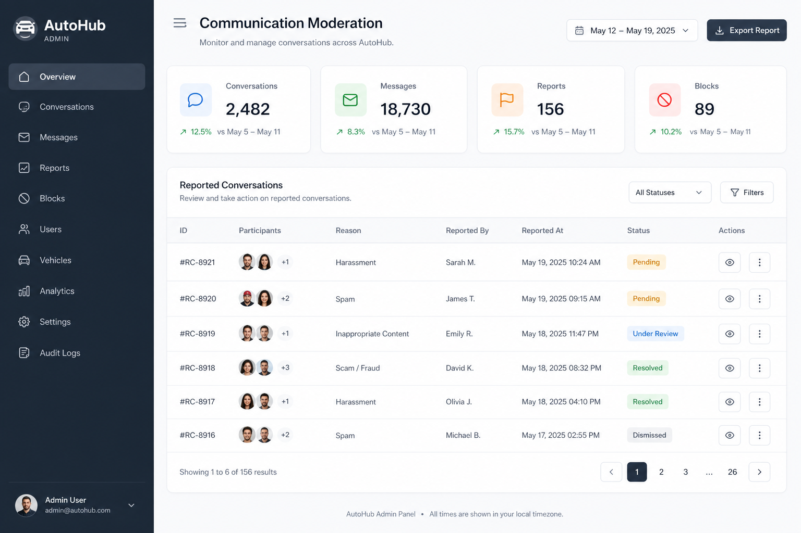

# Sprint 23 — Real-Time Communication Platform

Production-grade messaging for AutoHub covering **Vehicles and Plates without duplication**, via a shared `communication` domain keyed to `Listing` (and optional dealer organization).

## Architecture

```
                    ┌─────────────────────┐
                    │   Mobile / Admin    │
                    └──────────┬──────────┘
                               │ REST + Socket.IO (/chat)
                    ┌──────────▼──────────┐
                    │  Communication      │  Conversations, messages,
                    │  domain (Nest)      │  blocks, reports, follows
                    └──────────┬──────────┘
           ┌───────────────────┼───────────────────┐
           ▼                   ▼                   ▼
    Notifications         Prisma / PG          Presence
    (in-app + Expo        Conversation*        UserPresence
     push stub)           ChatMessage*
                          UserBlock / Reports
```

**No Vehicle/Plate chat forks.** Entry points pass `listingId` (domain denormalized as `marketplaceDomain`) or `dealerOrganizationId`.

### Realtime
- Nest `ChatGateway` namespace `/chat`
- JWT via `handshake.auth.token` or `Authorization`
- Events: `join_conversation`, `typing_*`, `message:new`, `message:status`, `presence:update`, `conversation:updated`

### Security
- Participant-only access enforced on every REST/WS path (`assertParticipantAccess`)
- Bidirectional `UserBlock` checks before send
- Spam detection hook flags messages (`detectSpam`)
- Permissions: `messages:read|write|moderate`

## Folder structure

```
packages/database/prisma/
  schema.prisma                          # Conversation*, ChatMessage, …
  migrations/20260725140000_sprint23_communication/

apps/api/src/domains/
  communication/                         # Shared messaging domain
    application/ conversations.service.ts, presence.service.ts
    domain/ policies, spam-detection
    infrastructure/ communication.repository.ts
    presentation/ controllers + chat.gateway.ts
  notifications/                         # Filled shell
    application/ notifications.service.ts, push.service.ts
    presentation/ notifications.controller.ts
  admin/
    application/admin-communication.service.ts
    presentation/admin-communication.controller.ts

apps/mobile/
  app/inbox/                             # Inbox + thread
  app/dealer/[id].tsx                    # Start Chat / Call / Share / Follow
  app/(tabs)/messages.tsx                # Tab → inbox
  src/features/chat/                     # repo, socket, offline queue, UI

apps/admin/src/app/(admin)/communication/page.tsx
```

## API integration

| Area | Endpoints |
| --- | --- |
| Listing chat | `POST /v1/conversations/listing` (+ first `LISTING_CARD` message) |
| Dealer chat | `POST /v1/conversations/dealer` |
| Inbox | `GET /v1/conversations?q&unreadOnly&archived` (+ `totalUnread`) |
| Messages | `GET/POST /v1/conversations/:id/messages` |
| Receipts | `POST …/read`, `POST …/delivered` |
| Typing | `POST …/typing` + WS |
| Inbox ops | `PATCH …` archive / mute / hide |
| Moderation | `POST …/report`, `POST/DELETE /v1/users/:id/block` |
| Dealers | `GET/POST/DELETE /v1/dealers/:id/follow` |
| Notifications | `GET/PATCH /v1/notifications`, `POST /v1/notifications/devices` |
| Admin | `GET /v1/admin/communication/stats\|reports\|blocks`, `POST …/moderate` |
| Realtime | Socket.IO `/chat` |

### Message types
`TEXT` · `IMAGE` · `LOCATION` · `LISTING_CARD` · `DEALER_CARD` · `CONTACT_CARD` · `SYSTEM`

### Push / alerts
| Event | Type |
| --- | --- |
| New message | `NEW_MESSAGE` (+ Expo push when token registered) |
| Dealer reply | `DEALER_REPLY` |
| Listing approved / rejected | `LISTING_APPROVED` / `LISTING_REJECTED` |
| Price change | `PRICE_CHANGE` (conversation participants) |
| Favourite update | `FAVOURITE_UPDATE` (helper ready) |

## Screenshots







> UI mock references for Sprint 23 surfaces. Apply migration + run API/mobile for live captures.

## Performance notes

- Inbox & messages paginated (`page` / `pageSize`, caps 50–100)
- Mobile infinite scroll on inbox + history
- Expo Image `memory-disk` cache on listing thumbs / chat images
- Optimistic send with `clientId` idempotency; offline queue in AsyncStorage with reconnect flush
- Failed sends retained in queue and retried every 8s when online
- Presence written on WS connect/disconnect; last seen persisted

## QA results

| Package | lint | typecheck | build |
| --- | --- | --- | --- |
| `@autohub/api` | Pass (`--max-warnings=0`) | Pass | Pass (`nest build`) |
| `@autohub/mobile` | Pass | Pass | Pass (`tsc`) |
| `@autohub/admin` | Pass | Pass | Pass (`next build`) |

Unit tests: communication policies + spam detection (9), listings service still green.

## Apply migration

```bash
cd packages/database
npx prisma migrate deploy
npx prisma generate
```

## Manual verification

1. Open a Vehicle or Plate detail → **Message Seller** → listing card attached → thread opens.
2. Dealer profile → **Start Chat** / Follow / Share.
3. Messages tab → search, unread filter, archive / mute / report / block.
4. Second device/user → typing, online, read receipts.
5. Admin → `/communication` stats, resolve reports, hide thread / remove message.
6. Approve/reject listing → seller notification; change price → inquiry participants notified.
